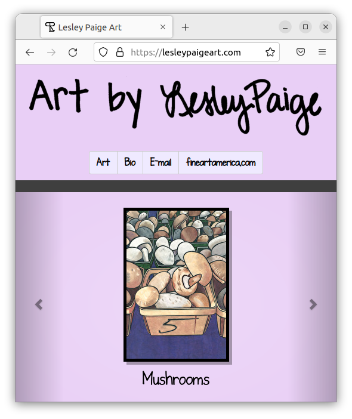
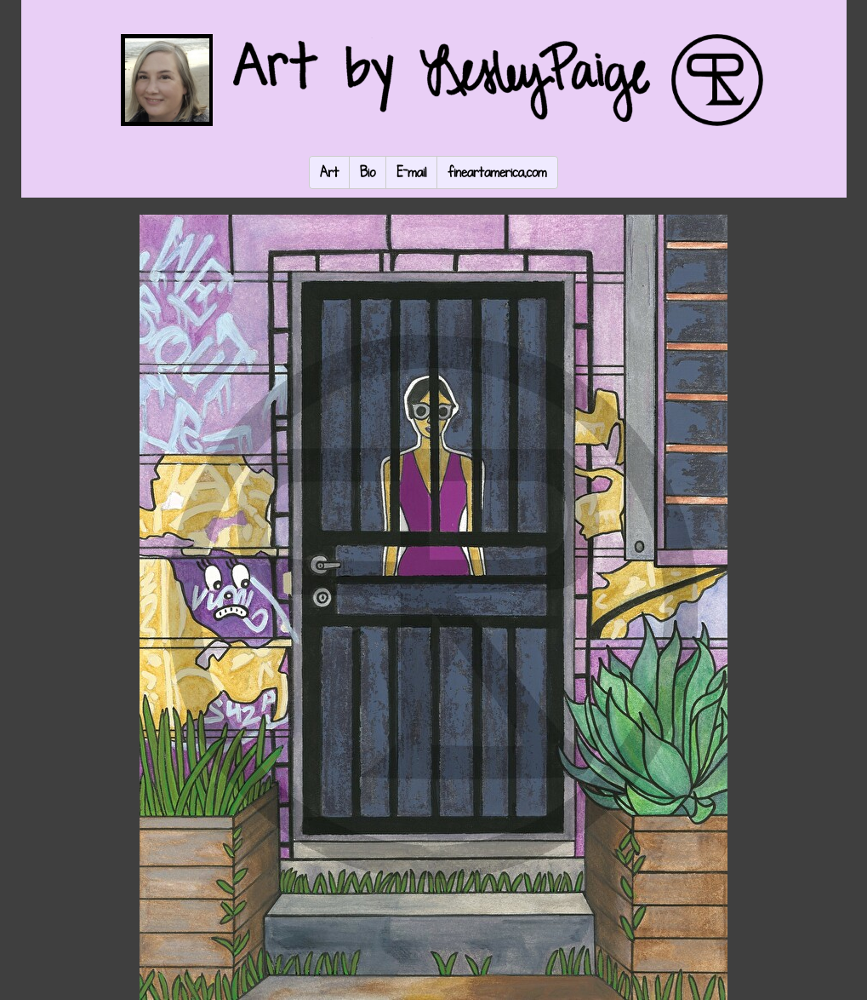
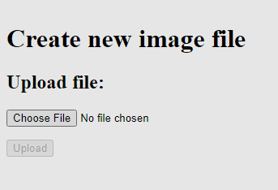

# Lesley Paige Art Website

[](https://github.com/RichardLitt/standard-readme)

This project is a dynamic and responsive art website available at [https://lesleypaigeart.com/](https://lesleypaigeart.com/).  The dynamic portion is a MySQL database with all the information needed (title, dimensions, price, etc) to display a piece of art on the site.  It is presented through PHP scripts using the PDO class.  A mobile size version of the site is supplied using Bootstrap, and otherwise sized using CSS.  The styles are also dynamic, using PHP scripts to present CSS files.


There is also a content management system (CMS) designed as a password protected admin directory.  Through this area, pieces of art can be added, edited, moved around, and hidden or shown.  The PHP  library called [**Imagick**](https://www.php.net/manual/en/class.imagick.php) (fork of the software **ImageMagick**) supplies most of the image editing functions.  The admin area allows the user to fully control the content, including style.  The style section allows the user to change the color scheme and the font stylings, but not the general appearance of the site.  These custom stylings are stored in the database and called upon using PHP files that generate CSS.  A full working demo of this admin area is available by visiting [https://lesley.spiffindustries.com/](https://lesley.spiffindustries.com/) and clicking the red "Admin Demo" button.


## Table of Contents

- [Security](#security)
- [Background](#background)
- [Install](#install)
- [Usage](#usage)
- [Contributing](#contributing)
- [License](#license)
- [Acknowledgements](#acknowledgments)

## Security

The site resides on [**Hostinger**](https://www.hostinger.com/) and is secured over https using an SSL certificate.  The admin area is password protected using an `.htaccess` and `.htpasswd` file.  A PDO PHP object is used to prevent any possible SQL injection.  The MySQL user for viewing the site is not the same as the one used for uploading and managing the artwork, and only has `SELECT` permissions.  Additional security measures are used for managing uploaded artwork in the admin area, including managing the folder and file permissions.  Finally, [Google Recaptcha V3](https://developers.google.com/recaptcha/docs/v3) is used to prevent non-human interactions in the admin area.

## Background

Lesley Paige began doing artwork at a young age.  This website is a showcase of her talent.  The admin area, in particular, gives her the ability to manage her artwork as it appears to the public at any time.

As an aside, an [Entity Relationship Diagram (ERD)](ERD.pdf) of the database is available for review. 

## Install

To replicate this project, it must reside on a server with PHP and MySQL/MariaDB installed.  The Imagick PHP library is also necessary to re-create the admin area.  No original artwork is supplied on GitHub.  Replicating the project will also require PHP database credentials files, also not supplied on GitHub.

### Prerequisites

* Web server such as Apache2 or NGINX, or access to shared hosting
* PHP (v7.3 was used, but this is not necessarily the minimum requirement)
* Imagick PHP libary (needed for admin area only)
* MySQL or MariaDB
* MySQL-PHP installation

### Installation notes

Server installations will vary from system to system and will not be discussed.  This document assumes that the user has some familiarity with such services.  It should be noted, however, that the **Imagick** library for PHP is not necessarily a standard service on shared hosting, and **Imagick** installation on Windows can be complicated.  Also, if you have control over your `php.ini` file, then you may have to adjust the upload maximum size and the memory limits for the admin area.  If you cannot adjust these, then you may have to reduce the size of an image before uploading it.

### Step-by-step instructions

1. Set up a web server with PHP and MySQL/MariaDB.  Instructions for this will vary by system.
1. Install **Imagick** for PHP on the server, if not already present.  *If your server doesn't have Imagick installed, then the admin area of the site will not work.*
1. Modify `php.ini` to increase the upload limit, the max memory allocation, and possibly the timeout limit.  *(Note: You may find that your web service does not allow this, or that you are experiencing problems even after raising these limits.  If this is the case, then your only other option is to reduce the size of an image prior to upload)*
1. Test to make sure that MySQL and Imagick are working before proceeding.
1. Clone the git project at [https://github.com/rbrutherford3/Lesley-Paige-Art.git](https://github.com/rbrutherford3/Lesley-Paige-Art.git) to a directory that your web service can access.
1. Password protect the admin directory through your server.  (ex: on Apache2, create an `.htaccess` file in the admin folder and configure appropriately)
1. Create two users for MySQL: one for viewing (limited permissions), and one for the admin area (full permissions).  Dividing access between users isn't absolutely necessary, but highly recommended.
1. Store the login information into two separate files: `credentials.php` and `admin/credentials.php`.  Add the credentials for limited access to the file in the root directory of the site, and the credentials for full access to the file in the admin directory.  The files should look like:
    ```
    <?php

    function credentials() {
        $host = 'localhost';
        $database = 'database';
        $username = 'username';
        $password = 'password';
        return array('HOST' => $host, 'DATABASE' => $database, 'USERNAME' => $username, 'PASSWORD' => $password);
    }

    ?>
    ```
    Be sure to replace `'database'`, `'username'` and `'password'` with appropriate values.
1. Create a file in the admin directory titled `admin/credentialsrecaptchav3.php` for the [Google Recaptcha V3](https://developers.google.com/recaptcha/docs/v3) that look like this:
    ```
    <?php
        const RECAPTCHA_SITE_KEY_V3="094kfk9LR4,V9KLS-a0UAJKTp";
        const RECAPTCHA_SECRET_KEY_V3="JKDK49CJBMkIF8kIF9Kkf-dkadfkAF3";
    ?>
    ```
    being sure to replace the strings in the file with a valid site key and secret key pair from Google (the values provided above will not work!).

## Usage

As previously mentioned, there are two main areas of the site: the user area that functions just as a regular dynamic website, and the admin area for content management.  In the following sections, each will be explained.

### User area

When the user visits the site, a self-explanatory menu appears to guide the experience.  This header exists in all areas of the site.  The following screenshot is the desktop view.


The following screenshot is the mobile view, which uses a carousel to view each artpiece.



Clicking on an artpiece yields a detialed description of the piece.  It contains the thumbnail, title, and other information such as size, price, availability, etc.  There are also external links for purchase information.


Clicking on the thumbnail yields a larger watermarked image of the piece.



### Admin Area

The admin area allows the user to manage the artwork displayed on the website by adding new pieces, editing the information for existing pieces, changing the order of display, or removing existing pieces.  The user can also edit the biography information and the font and color scheme.


The following screenshot is reached by clicking "Edit existing pieces".  From here, the user can change the order that the artwork is displayed on the site, publish or unpublish artwork on the site, edit artwork information by clicking on a piece, or add new artwork.


The following screenshot shows the page that results from clicking "Add new piece" from the main admin menu, "Add new artpiece" from the "Edit artwork" page, or by editing the file of an existing piece.  The user simply chooses a file on their device to upload.



The user is then prompted to rotate the image, as necessary, by clicking on it.  The user must then click "Apply rotation" when the image is correctly oriented.


The user is then prompted to crop the image, as necessary, by increasing or decreasing the four margins.  The radio buttons allow the user to change the step size of the margin adjustment.  The user must then click "Apply crop" when the image is sufficiently cropped.

*Note: the original image is stored and the rotation angle and crop margin values are saved in the database to allow future re-editing*


The user is then presented with a draft of the final resulting images, including a watermarked version, to be reviewed.  The user may either click "Re-do" to repeat the process or "Save" to submit the results.


The user must then enter the information about the artpiece to be presented on the website and click "Save" to submit the entries.  This screen is also reached by clicking on a piece in the "Edit artwork" page.  Note that you can also go back and change the image file and/or rotation and/or crop margins by clicking the buttons below the artpiece thumbnail.


The user must confirm that the information entered is correct before it can be saved to the database.


The following form is reached by clicking "Change Page Style" in the main admin menu.  It is for changing the color scheme and the fonts used for the site.  These changes are saved to the database and used dynamically by the site to render the chosen styles.  Old stylings are saved in case there is a need to revert to a previous styling.


Finally, clicking the "Edit biography" button in the main admin menu takes the user to an area where they can edit the biography displayed on the site.

## Contributing

Please contact me (rbrutherford3 on GitHub) in order to inquire more about the project.

## License

[MIT © Robert Rutherford](../LICENSE)

## Acknowledgments

* Thanks to Lesley, for being patient with me as I built this, and for supplying the computer to do so.
* Thanks to Victor Semenov and Lukas Svrcek for helping me out with tips when I needed it.
* Thanks to Starbucks for not kicking me out when I stayed there for a few hours working on it.
